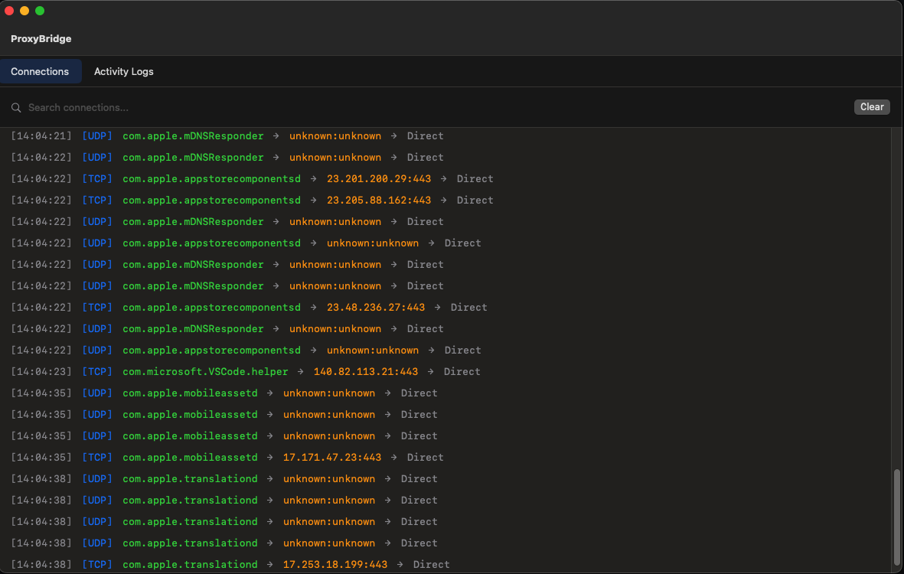
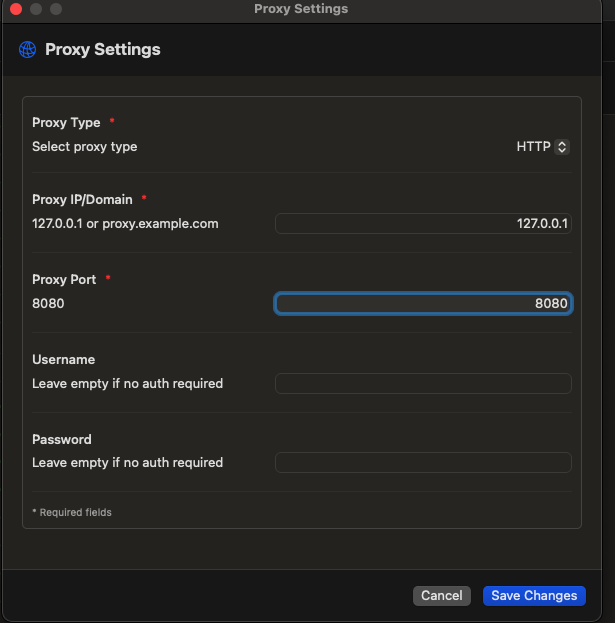
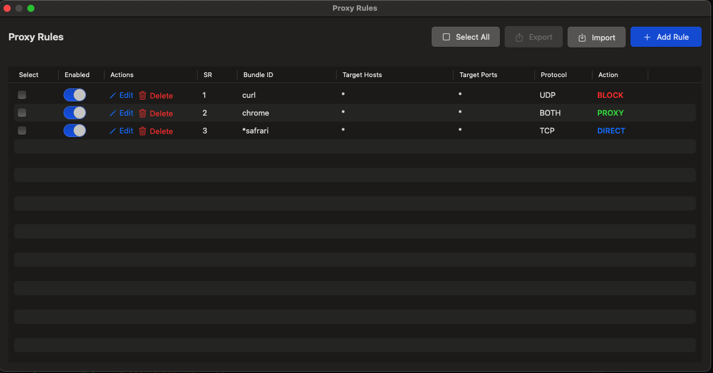
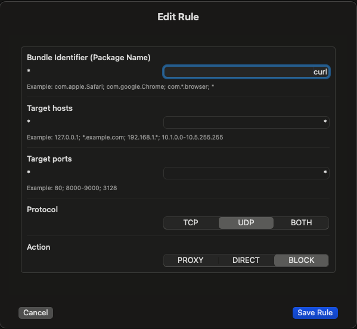

# ProxyBridge for macOS

ProxyBridge is a transparent proxy application for macOS that allows you to route network traffic through HTTP or SOCKS5 proxies with granular control using rules based on application, destination, and protocol.

## Table of Contents

- [Overview](#overview)
- [Architecture](#architecture)
- [Installation](#installation)
- [Configuration](#configuration)
  - [Proxy Settings](#proxy-settings)
  - [Proxy Rules](#proxy-rules)
  - [Exporting and Importing Rules](#exporting-and-importing-rules)
- [Usage](#usage)
- [Limitations](#limitations)
- [Building from Source](#building-from-source)
- [License](#license)

## Overview

ProxyBridge leverages macOS Network Extension framework to intercept and route network traffic. It provides a GUI application for configuration and uses a system extension to handle traffic routing based on user-defined rules.

<p align="center">
  
  <br/>
  <em>ProxyBridge Main Window</em>
</p>

## Architecture


```
┌─────────────┐
│             │  (1) TCP/UDP packet
│ Application │       ↓
│             │
└─────────────┘
       │
       │
[user mode]───────────────────────────────────────────────────────────────────────
       │
       │  (2) Packet intercepted via Network Extension
       ↓
┌──────────────────────┐
│                      │
│   ProxyBridge        │
│   Extension          │
│   (System Extension) │
│                      │
└──────────────────────┘
       │
       │  (3) Rule matching
       ↓
   ┌───────────────────────────────────────┐
   │                                       │
   │  Match rules:                         │
   │  - Package name (bundle ID)           │
   │  - Destination IP/hostname (TCP only) │
   │  - Destination port (TCP only)        │
   │  - Protocol (TCP/UDP/Both)            │
   │                                       │
   └───────────────────────────────────────┘
       │
       │
       ├──────(4a) Rule matched: PROXY────────────────────────┐
       │                                                       │
       ├──────(4b) Rule matched: DIRECT───────────────────┐   │
       │                                                   │   │
       ├──────(4c) Rule matched: BLOCK──────────┐         │   │
       │                                        │         │   │
       └──────(4d) No rule matched─────────┐   │         │   │
                                           │   │         │   │
                                           ↓   ↓         ↓   ↓
                                       ┌────────────────────────────┐
                                       │  ProxyBridge Network       │
                                       │  Manager                   │
                                       │  (4e) Store original       │
                                       │       dest IP/port         │
                                       │  (4f) Log connection       │
                                       └────────────────────────────┘
                                                     │
                       ┌─────────────────────────────┼─────────────────────┐
                       │                             │                     │
                       │                             │                     │
           (5) BLOCK   │                 (6) DIRECT  │         (7) PROXY   │
               │       │                     │       │             │       │
               ↓       │                     ↓       │             ↓       │
          Connection   │              Pass to OS     │    ┌─────────────────────────┐
            Dropped    │              (Direct)       │    │ Extension creates       │
                       │                     │       │    │ NWTCPConnection or      │
                       │                     ↓       │    │ NWUDPSession to proxy   │
                       │              ┌────────────┐ │    └─────────────────────────┘
                       │              │ Remote     │ │              │
                       │              │ Server     │ │              │
                       │              └────────────┘ │              ↓
                       │                             │    ┌─────────────────────────┐
                       │                             │    │ Proxy Server            │
                       │                             │    │ - HTTP Proxy, or        │
                       │                             │    │ - SOCKS5 Proxy          │
                       │                             │    │                         │
                       │                             │    │ (8) Extension handles   │
                       │                             │    │     proxy handshake &   │
                       │                             │    │     data relay          │
                       │                             │    └─────────────────────────┘
                       │                             │              │
                       │                             │              ↓
                       │                             │    ┌─────────────────────────┐
                       │                             │    │ Remote Server           │
                       │                             │    │ (Final destination)     │
                       │                             │    └─────────────────────────┘
                       │                             │
                       └─────────────────────────────┴─────────────────────────────
                                         │
                                         │  (9) Response flows back through
                                         │      extension to application
                                         ↓
                                   [Application]
```

### Key Components

1. **GUI Application** (User Mode)
   - Configuration interface for proxy settings
   - Rule management (add, delete, enable/disable)
   - Connection log viewer
   - Stored in UserDefaults and shared with extension

2. **Network Extension** (System Extension)
   - Runs as a system extension
   - Intercepts all TCP/UDP traffic system-wide
   - Evaluates traffic against configured rules
   - Routes traffic based on rule actions
   - Creates NWTCPConnection for TCP proxy connections
   - Creates NWUDPSession for SOCKS5 UDP associations
   - Handles proxy protocol handshakes (HTTP CONNECT, SOCKS5)
   - Relays data between application and proxy server
   - Supports both HTTP and SOCKS5 proxies with authentication

3. **Network Manager**
   - Stores original destination details
   - Logs all connection attempts
   - Tracks active connections
   - Handles authentication when credentials provided

### Traffic Flow Details

1. **Application initiates connection** - Any application on the system makes a network request
2. **Network Extension intercepts** - ProxyBridge extension receives the connection request via NETransparentProxyProvider
3. **Rule evaluation** - Extension checks configured rules against:
   - Application bundle identifier (package name)
   - Destination IP/hostname (TCP only)
   - Destination port (TCP only)
   - Protocol (TCP/UDP/Both)
4. **Action execution**:
   - **(4a) PROXY** - Extension creates NWTCPConnection/NWUDPSession to proxy server
   - **(4b) DIRECT** - Allows direct connection bypassing proxy
   - **(4c) BLOCK** - Blocks the connection entirely
   - **(4d) No Match** - Passes to OS (Direct for TCP, logged with "unknown" for UDP)
5. **Logging** - Connection details are logged and sent to GUI
6. **Proxy handling** - For PROXY action, extension handles proxy handshake and relays data
7. **Final destination** - Traffic reaches remote server either directly or through proxy
5. **Logging** - Connection details are logged and visible in the GUI
6. **Proxy handling** - For PROXY action, establishes connection to configured proxy server
7. **Final destination** - Traffic reaches remote server either directly or through proxy

## Installation

1. Download the latest release from the [releases page](https://github.com/InterceptSuite/ProxyBridge/releases)
2. Open the downloaded `.pkg` file
3. Follow the installation wizard
4. Grant System Extension permissions when prompted
5. Launch ProxyBridge from Applications folder

**Note:** ProxyBridge requires system extension permissions. You need to allow the extension in **System Settings → General → Login Items & Extensions → Network Extension** on first launch.


## Configuration

### Proxy Settings

Access proxy settings from **Menu Bar → Proxy → Proxy Settings**.

<p align="center">
  
  <br/>
  <em>Proxy Settings Window</em>
</p>

#### Supported Proxy Types
- **HTTP** - Standard HTTP/HTTPS proxy
- **SOCKS5** - SOCKS5 proxy with optional UDP support

#### Configuration Fields

| Field | Description | Required | Format |
|-------|-------------|----------|--------|
| Proxy Type | Select HTTP or SOCKS5 | Yes | Dropdown selection |
| Proxy Host | Proxy server IP address, hostname, or domain | Yes | IPv4, IPv6, or domain name |
| Proxy Port | Proxy server port number | Yes | 1-65535 |
| Username | Proxy authentication username | No | Text |
| Password | Proxy authentication password | No | Text |

#### Examples

**HTTP Proxy**
```
Type: HTTP
Host: proxy.example.com
Port: 8080
Username: myuser
Password: mypass
```

**SOCKS5 Proxy**
```
Type: SOCKS5
Host: 127.0.0.1
Port: 1080
Username: (optional)
Password: (optional)
```

### Proxy Rules

Access proxy rules from **Menu Bar → Proxy → Proxy Rules**.

<p align="center">
  
  <br/>
  <em>Proxy Rules Window</em>
</p>

Rules determine how network traffic is handled. Multiple rules can be created, and they are evaluated in order until a match is found.

#### Rule Components

| Component | Description | Supports TCP | Supports UDP |
|-----------|-------------|--------------|--------------|
| Package Name | Application bundle identifier | Yes | Yes |
| IP/Hostname | Destination IP address or domain | Yes | No* |
| Port | Destination port number | Yes | No* |
| Protocol | TCP, UDP, or Both | Yes | Yes |
| Action | PROXY, DIRECT, or BLOCK | Yes | Yes |

**Note:** UDP rules only match on package name due to Apple API limitations. IP and port-based filtering is not available for UDP traffic.

#### Actions

- **PROXY** - Route traffic through the configured proxy server
- **DIRECT** - Allow direct connection bypassing the proxy
- **BLOCK** - Block the connection entirely

#### Rule Management

- **Add Rule** - Create a new rule with specified criteria
- **Enable/Disable** - Toggle rules on/off without deleting them
- **Delete** - Remove rules permanently
- **List All** - View all configured rules and their status

<p align="center">
  
  <br/>
  <em>Add/Edit Rule Window</em>
</p>

#### Rule Examples

**Block all traffic from specific app**
```
Package Name: com.example.app
IP/Hostname: (empty)
Port: (empty)
Protocol: Both
Action: BLOCK
```

**Route browser through proxy**
```
Package Name: com.google.Chrome
IP/Hostname: (empty)
Port: (empty)
Protocol: TCP
Action: PROXY
```

**Direct connection for specific domain**
```
Package Name: (empty)
IP/Hostname: trusted.example.com
Port: 443
Protocol: TCP
Action: DIRECT
```

**UDP traffic from specific app through SOCKS5**
```
Package Name: com.example.voipapp
IP/Hostname: (ignored for UDP)
Port: (ignored for UDP)
Protocol: UDP
Action: PROXY
```

#### Exporting and Importing Rules

ProxyBridge allows you to export selected rules to a JSON file and import rules from previously exported files.

**Export Rules:**
1. Select one or more rules using the checkboxes
2. Click the **Select All** button to select all rules (optional)
3. Click the **Export** button
4. Choose a location and save the JSON file

**Import Rules:**
1. Click the **Import** button
2. Select a previously exported JSON file
3. Rules will be imported and added to your existing rules

**JSON Format Example:**
```json
[
  {
    "action" : "DIRECT",
    "enabled" : true,
    "processNames" : "curl",
    "protocol" : "BOTH",
    "targetHosts" : "*",
    "targetPorts" : "*"
  }
]
```

## Usage

### Starting ProxyBridge

1. Launch ProxyBridge from Applications
2. The app runs in the menu bar
3. Configure proxy settings and rules as needed
4. Enable the system extension when prompted
5. Traffic will be routed according to your rules

### Viewing Logs

Connection logs are available in the main window, showing:
- Protocol (TCP/UDP)
- Application package name
- Destination IP/hostname
- Destination port
- Action taken (PROXY/DIRECT/BLOCK)

### Menu Bar Controls

- **Proxy Settings** - Configure proxy server details
- **Proxy Rules** - Manage traffic routing rules
- **Help** - Check for updates and about information
- **Quit** - Exit ProxyBridge

## Limitations

### Apple Network Extension API Constraints

1. **Package Name vs Process Name**
   - Rules use application bundle identifier (package name), not process name
   - Apple's Network Extension API does not provide access to process names
   - Use `com.example.app` format instead of executable names

2. **UDP Traffic Limitations**
   - UDP rules can only match on package name
   - Destination IP and port are not available for UDP traffic when not handled by the extension
   - This is an Apple API limitation in the Network Extension framework
   - UDP traffic that doesn't match a rule is passed to the OS directly and logged with "unknown" IP/port

3. **System Traffic**
   - Some system processes may bypass the extension
   - Critical macOS services are not intercepted for system stability

### Protocol Support

- **TCP** - Full support with all rule matching criteria
- **UDP** - Limited to package name matching only
- **SOCKS5 UDP** - Supported when rules match and proxy through SOCKS5

## Building from Source

### Requirements

- macOS 13.0 or later
- Xcode 14.0 or later
- Swift 5.7 or later
- Valid Apple Developer account for code signing

### Build Steps

1. Clone the repository:
   ```bash
   git clone https://github.com/InterceptSuite/ProxyBridge.git
   cd ProxyBridge/MacOS/ProxyBridge
   ```

2. Open the project:
   ```bash
   open ProxyBridge.xcodeproj
   ```

3. Configure code signing in Xcode:
   - Select the ProxyBridge target
   - Go to Signing & Capabilities
   - Select your development team

4. Build the project:
   ```bash
   xcodebuild -project ProxyBridge.xcodeproj -scheme ProxyBridge -configuration Release build
   ```

5. The built application will be in:
   ```
   ~/Library/Developer/Xcode/DerivedData/ProxyBridge-*/Build/Products/Release/ProxyBridge.app
   ```

### Creating an Installer

To create a `.pkg` installer, additional packaging steps are required using `pkgbuild` or a similar tool. See the [packaging documentation](https://developer.apple.com/documentation/xcode/distributing-your-app-for-beta-testing-and-releases) for details.

## License

See the [LICENSE](../LICENSE) file for details.

---

